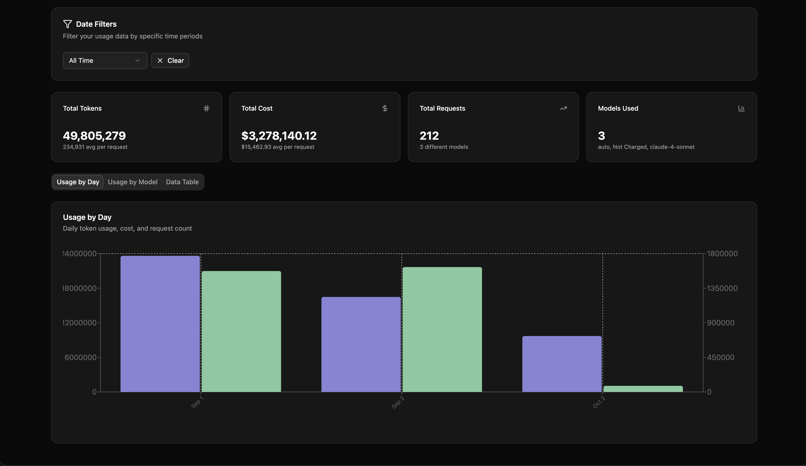
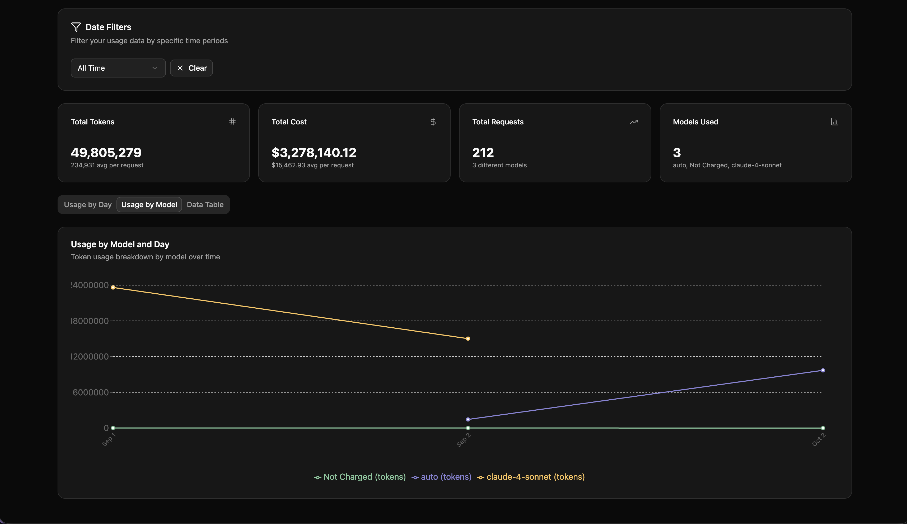
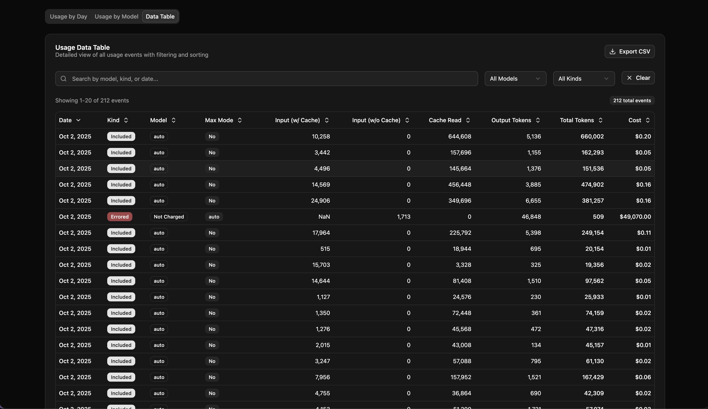

# Cursor Insights Dashboard

A comprehensive analytics dashboard for analyzing Cursor AI usage patterns, built with React, TypeScript, and modern web technologies.

> **🤖 Vibe-Coded Project**: This entire project was created through AI-assisted development using Cursor. The codebase represents an exploration of modern web technologies and patterns, with many implementation details discovered through the development process. If you're curious about what's inside, dive in and explore! 🚀

## 📸 Screenshots

### 📊 Usage by Day Chart


_Interactive bar chart showing daily token usage and costs with theme support_

### 📈 Usage by Model Chart


_Line chart comparing usage patterns across different AI models over time_

### 📋 Data Table


_Comprehensive data table with filtering, sorting, and export functionality_

## 🚀 Features

### 📊 **Analytics & Visualization**

- **Usage by Day Charts** - Interactive bar charts showing daily token usage and costs
- **Model Comparison** - Line charts comparing usage across different AI models
- **Summary Statistics** - Key metrics including total tokens, costs, and request counts
- **Date Filtering** - Filter data by day, month, year, or custom date ranges

### 📋 **Data Table**

- **Complete CSV Display** - View all columns from your usage data
- **Advanced Filtering** - Search and filter by model, kind, date, and more
- **Sorting** - Click any column header to sort data
- **Pagination** - Handle large datasets efficiently
- **CSV Export** - Download filtered data for further analysis

### 🎨 **User Experience**

- **Light/Dark Theme** - Toggle between light and dark modes
- **Responsive Design** - Works perfectly on desktop, tablet, and mobile
- **Modern UI** - Built with shadcn/ui components for professional appearance
- **Drag & Drop Upload** - Easy CSV file upload with validation

### 🔧 **Technical Features**

- **TypeScript** - Full type safety throughout the application
- **React 19** - Latest React features and optimizations
- **Vite** - Fast development and build times
- **Tailwind CSS** - Utility-first styling with dark mode support
- **Recharts** - Interactive and responsive charts

## 📁 Project Structure

```
src/
├── components/
│   ├── ui/                 # shadcn/ui components
│   ├── Dashboard.tsx      # Main dashboard component
│   ├── UsageByDayChart.tsx # Daily usage visualization
│   ├── UsageByModelChart.tsx # Model comparison charts
│   ├── UsageDataTable.tsx # Data table with filtering
│   ├── DateFilter.tsx     # Date range filtering
│   ├── FileUpload.tsx     # CSV upload component
│   ├── ThemeProvider.tsx  # Theme management
│   └── ThemeSwitcher.tsx  # Theme toggle component
├── lib/
│   └── utils.ts          # Utility functions and data processing
└── App.tsx               # Main application component
```

## 🛠️ Getting Started

### Prerequisites

- Node.js 20.19+ or 22.12+ (required for Vite)
- npm or yarn

### Installation

1. **Clone the repository**

   ```bash
   git clone <repository-url>
   cd cursor-insights
   ```

2. **Install dependencies**

   ```bash
   npm install
   ```

3. **Start development server**

   ```bash
   npm run dev
   ```

4. **Open your browser**
   Navigate to `http://localhost:5173`

## 📊 Usage

### Uploading Data

1. **Prepare your CSV** - Export usage data from Cursor
2. **Upload file** - Drag and drop or click to select your CSV
3. **View insights** - Explore charts, tables, and analytics

### CSV Format

The dashboard expects CSV files with the following columns:

- `Date` - Timestamp of the request
- `Kind` - Request status (Included/Errored, Not Charged)
- `Model` - AI model used
- `Max Mode` - Mode setting
- `Input (w/ Cache Write)` - Input tokens with cache
- `Input (w/o Cache Write)` - Input tokens without cache
- `Cache Read` - Cache read tokens
- `Output Tokens` - Output tokens generated
- `Total Tokens` - Total tokens used
- `Cost` - Cost in USD

### Features Overview

- **📈 Charts** - Visualize usage patterns over time
- **🔍 Filtering** - Filter by date ranges, models, and request types
- **📋 Table** - Detailed view of all usage events
- **💾 Export** - Download filtered data as CSV
- **🌙 Themes** - Switch between light and dark modes

## 🔍 Exploration & Discovery

This project was built through **vibe-coding** - an exploratory approach to development where the implementation emerges through experimentation and discovery. Here's what you might find interesting:

### 🧪 **Experimental Features**

- **Dynamic column detection** - The table automatically detects CSV column names
- **Theme-aware charts** - Charts adapt colors based on light/dark mode
- **Smart filtering** - Multiple filter types that work together seamlessly
- **Responsive design patterns** - Mobile-first approach with progressive enhancement

### 🎯 **Learning Opportunities**

- **Modern React patterns** - Hooks, context, and component composition
- **TypeScript integration** - Type safety with flexible data structures
- **Chart libraries** - Recharts integration with custom tooltips
- **UI component systems** - shadcn/ui implementation and customization
- **State management** - Local state with React hooks and context

### 🔧 **Technical Discoveries**

- **CSV parsing challenges** - Handling different column naming conventions
- **Chart theming** - CSS variables for dynamic color schemes
- **Performance optimization** - Memoization and efficient re-rendering
- **Accessibility** - ARIA labels and keyboard navigation

## 🎨 Customization

### Adding New Chart Types

1. Create a new component in `src/components/`
2. Add it to the Dashboard tabs
3. Implement data processing in `src/lib/utils.ts`

### Styling

- Uses Tailwind CSS for styling
- shadcn/ui components for consistent design
- CSS variables for theme support

### Data Processing

- CSV parsing in `src/lib/utils.ts`
- Filtering and sorting logic
- Date formatting and number formatting utilities

## 🚀 Deployment

### Build for Production

```bash
npm run build
```

### Preview Production Build

```bash
npm run preview
```

### Deploy to Vercel/Netlify

The project is ready for deployment to modern hosting platforms:

- Vercel: Connect your GitHub repository
- Netlify: Drag and drop the `dist` folder
- GitHub Pages: Use GitHub Actions for automated deployment

## 📝 License

This project is open source and available under the [MIT License](LICENSE).

## 🤝 Contributing

Contributions are welcome! Please feel free to submit a Pull Request.

## 📞 Support

If you encounter any issues or have questions, please open an issue on GitHub.
